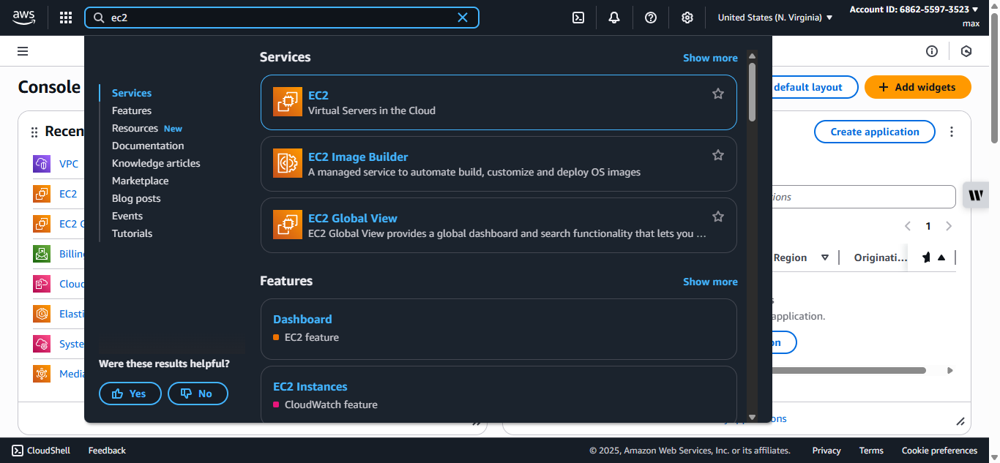

# 🚀 Mastering the LEMP Stack: Architecture, Use Cases, and Deployment in Modern Web Development

📌 **Author:** Maxwell Ugochukwu  
🧑‍💻 **Role:** Cloud & DevOps Engineer  
📆 **Date:** August 2025  
🌍 **Region:** Nigeria  
🧪 **Tested On:** Ubuntu Server 24.04 LTS (EC2)  
💼 **Purpose:** Showcase technical skills for DevOps/Cloud Engineer roles, cloud provisioning, and application hosting using open-source tools.

---

## 📚 Table of Contents

1. [📖 What is a LEMP Stack?](#-what-is-a-lemp-stack)
2. [🌟 Why is the LEMP Stack Still Relevant Today?](#-why-is-the-lemp-stack-still-relevant-today)
3. [🛠️ What is the LEMP Stack Used For?](#️-what-is-the-lemp-stack-used-for)
4. [🏗️ LEMP Stack Architecture](#️-lemp-stack-architecture)
5. [🚀 Deployment Steps (Tested on Ubuntu Server 2404 LTS)](#-deployment-steps-tested-on-ubuntu-server-2404-lts)
6. [🔍 Troubleshooting Tips (Based on My Deployment Experience)](#-troubleshooting-tips-based-on-my-deployment-experience)

---

## 📖 What is a LEMP Stack?

The **LEMP stack** is a collection of open-source technologies used together to develop and deploy modern web applications.  
**LEMP** stands for:

- **Linux** – Operating system that serves as the foundation.
- **Nginx** (pronounced *Engine-X*) – High-performance, event-driven web server.
- **MySQL** – Relational database management system.
- **PHP** – Server-side scripting language for dynamic content.

LEMP is a popular alternative to the LAMP stack (Apache instead of Nginx) and is widely adopted for high-performance websites and APIs.

---

## 🌟 Why is the LEMP Stack Still Relevant Today?

Despite the rise of serverless, containerized, and JAMstack solutions, the LEMP stack remains highly relevant due to:

1. **Performance** – Nginx outperforms many traditional web servers for concurrent connections.
2. **Flexibility** – Each layer is replaceable (e.g., MariaDB for MySQL, Python instead of PHP).
3. **Cost-effectiveness** – 100% open-source, no licensing fees.
4. **Global Support** – Large, active community with extensive documentation.
5. **Proven Stability** – Powers many production-grade websites for over a decade.

---

## 🛠️ What is the LEMP Stack Used For?

LEMP powers both **static** and **dynamic** web content:

- **Static websites** – HTML/CSS files served directly by Nginx.
- **Dynamic applications** – PHP scripts that interact with a MySQL database to serve personalized or real-time data.
- **API backends** – RESTful or GraphQL APIs for mobile and web apps.
- **CMS platforms** – WordPress, Drupal, and Joomla optimized for Nginx.

---

## 🏗️ LEMP Stack Architecture

Below is a simplified visual representation of how the components interact:


      ┌─────────────────────────────────────┐
      │              Browser                 │
      │  (User Request: example.com)         │
      └─────────────────────────────────────┘
                       │
                       ▼
      ┌─────────────────────────────────────┐
      │               Nginx                  │
      │  - Serves static files directly      │
      │  - Routes PHP requests to PHP-FPM    │
      └─────────────────────────────────────┘
                       │
             PHP Request│
                       ▼
      ┌─────────────────────────────────────┐
      │               PHP-FPM                │
      │  - Executes PHP code                 │
      │  - Communicates with MySQL           │
      └─────────────────────────────────────┘
                       │
          SQL Queries  │
                       ▼
      ┌─────────────────────────────────────┐
      │               MySQL                  │
      │  - Stores and retrieves data         │
      │  - Sends results to PHP-FPM          │
      └─────────────────────────────────────┘
                       │
                 HTML Output│
                       ▼
      ┌─────────────────────────────────────┐
      │               Browser                │
      │  - Displays rendered HTML            │
      └─────────────────────────────────────┘


---

## 🚀 Deployment Steps (Tested on Ubuntu Server 24.04 LTS)

### AWS EC2 instance setup (step-by-step):

Follow these steps in the AWS Console. This is the minimal setup to SSH + serve web.

**1. Launch instance**

Login to the AWS Management Console: https://aws.amazon.com/console/

- Service: Search for EC2 → click on Launch Instance




- Name: Give your instance a name, here we name it `lemp-server`,


- AMI: Ubuntu Server 24.04 LTS


- Instance type: chose an instance, here we pick `t2.micro` (free tier) and click on `create new key pair`


**2. Key pair**

- Create key pair: Give your key a name,  here: `lempserver-key` using (RSA .pem) click on `create key pair` → Download once and store secure.


- Storage: adjust as required (default is fine for this demo)

**3. Network / Subnet**

- Ensure your chosen subnet has Auto-assign Public IPv4 enabled (or you will not have a public IP).
- Auto-assign public IP is important: without it the instance is private and unreachable from the internet unless you associate an Elastic IP or have a bastion host. Click edit to enable Auto-assign IP


**4. Security group**
- Click on create security group


- Enable Inbound Rule:

- SSH (TCP 22) from your IP (restrict to your IP for security) — for testing 0.0.0.0/0 but not recommended for prod. This is enabled by default.


- HTTP (TCP 80) from anywhere (0.0.0.0/0). Click on `Add security group rule`


- Outbound: Default outbound allow (so instance can talk to the internet).

**5. Launch and wait until running and status checks are passing.**


- When you get the `Success` prompt our instance is ready for use. click on the instance ID to view instance details


- Click on `Connect` and select the `SSH` tab to view details for SSHing into your  instance


**6. Optional — Elastic IP**

- EC2 → Network & Security → Elastic IPs → Allocate Elastic IP → Associate to instance (prevents IP changes on stop/start).

### SSH — connect from Windows / WSL / Linux

- **On WSL or Linux shell (recommended):**

```bash
# copy key from Windows downloads to WSL home (if on Windows)
cp /mnt/c/Users/<YourWindowsUser>/Downloads/lempserver-key.pem ~/
chmod 400 ~/lempserver-key.pem

# connect
ssh -i ~/lempserver-key.pem ubuntu@<EC2-Public-IP>
```


---

### Install Nginx

- Run these on the EC2 instance after SSHing in (not locally in Git Bash) to install `nginx`(Engine-X) our web server:

```bash
sudo apt update
sudo apt install -y nginx
```


- To confirm if `nginx` is now active, run:

```bash
sudo systemctl status nginx
```


- If nginx is not active, run this to enable/activate nginx:

```bash
sudo systemctl enable --now nginx
```

- Test locally on the instance:
```bash
curl -I http://localhost
# or
curl http://127.0.0.1:80
```
If you see `HTTP/1.1 200 OK` or the default Nginx HTML, Nginx is serving.


- Test on a browser

```bash
http://<EC2-Public-IP>:80
```


---

### Install MySQL & secure it
```bash
sudo apt install -y mysql-server
# start/enable if mysql does not start by default
sudo systemctl enable --now mysql
# enter mysql shell as root (Ubuntu uses socket auth):
sudo mysql
```


- Inside mysql shell: Run;

```sql
ALTER USER 'root'@'localhost' IDENTIFIED WITH mysql_native_password BY 'PassWord.1';
EXIT;
```


- Then run:

```bash
sudo mysql_secure_installation
```


- Follow prompts to remove test DBs, disable remote root login (unless you need it), and set recommended security options.

* To test your new password works, run
```bash
sudo mysql -p
```
    input the password you set earlier, if logged in to mysql successfully then you are on track. Exit.


---

### Install PHP & PHP-FPM (and modules)

- Install PHP and check version

```bash
sudo apt install -y php-fpm php-mysql
php -v
```


---

### Configure Nginx to use PHP-FPM (project site)

- Create project folder and set owner:

```bash
sudo mkdir -p /var/www/projectLEMP
sudo chown -R $USER:$USER /var/www/projectLEMP
```


- Create site config:

```bash
sudo nano /etc/nginx/sites-available/projectLEMP
```


- Paste and save

```nginx
server {
    listen 80;
    server_name projectLEMP www.projectLEMP;

    root /var/www/projectLEMP;
    index index.php index.html index.htm;

    location / {
        try_files $uri $uri/ =404;
    }

    location ~ \.php$ {
        include snippets/fastcgi-php.conf;
        fastcgi_pass unix:/run/php/php8.3-fpm.sock;
        fastcgi_param SCRIPT_FILENAME $document_root$fastcgi_script_name;
        include fastcgi_params;
    }

    location ~ /\.ht {
        deny all;
    }
}
```


- Enable, test and reload:

```bash
sudo ln -s /etc/nginx/sites-available/projectLEMP /etc/nginx/sites-enabled/
sudo nginx -t
sudo unlink /etc/nginx/sites-enabled/default
sudo systemctl reload nginx
```


---

###  Test: static and PHP pages

- Create a static index:

```bash
sudo nano /var/www/projectLEMP/index.html
```


-Paste and save

```html
<!DOCTYPE html>
<html>
<head>
    <meta charset="utf-8">
    <title>Hello LEMP</title>
</head>
<body>
    <h1>Hello LEMP from ip-$(hostname)</h1>
</body>
</html>
```
(Replace $(hostname) manually if copying.)


- Visit in browser: `http://<EC2-Public-IP>:80`


- Create PHP info (temporary):

```bash
sudo nano /var/www/projectLEMP/info.php 
```


- Paste and save

```php
<?php
phpinfo();
```


- Visit in browser: `http://<EC2-Public-IP>/info.php` — delete `info.php` after verifying to maintain security:


```bash
sudo rm /var/www/projectLEMP/info.php
```


---

### Create DB, table and insert sample rows (MySQL)

- Login as root:

```bash
sudo mysql -p
# enter root password set earlier
```

- Then create a database

```sql
CREATE DATABASE example_database;
```


- Next, create a database user and assign all priviledges to your user. Exit

```sql
CREATE USER 'example_user'@'%' IDENTIFIED WITH mysql_native_password BY 'PassWord.1';
GRANT ALL PRIVILEGES ON example_database.* TO 'example_user'@'%';
```


- Login to your database user and input your password

```bash
mysql -u example_user -p
```


- Confirm you have access to the `example_database' database:

```sql
SHOW DATABASES;
```


- Create a table in the database named `todo_list', run the following statement:

```sql
CREATE TABLE example_database.todo_list (
  item_id INT AUTO_INCREMENT,
  content VARCHAR(255),
  PRIMARY KEY(item_id)
);
``` 


- Now, use the `INSERT` statement to insert a few rows of content in the test table, you might want to repeat the command a few times using different values:

```sql
INSERT INTO example_database.todo_list (content) VALUES
('My first important item'),
```


- To confirm the data was successfully saved to your table, run:

```sql
SELECT * FROM example_database.todo_list;
```


- After confirming you can exit the MYSQL console

```sql
EXIT;
```

---

### Retrieve data with PHP (PDO example)

- Create a PHP script `todo_list.php` that will connect to MYSQL and query for your content:

```bash
sudo nano /var/www/projectLEMP/todo_list.php 
```


- Paste in the following PHP script and save

```php
<?php
$user = "example_user";
$password = "PassWord.1";
$database = "example_database";
$table = "todo_list";

try {
    $db = new PDO("mysql:host=localhost;dbname=$database", $user, $password);

    echo "<h2>TODO</h2><ol>";
    foreach ($db->query("SELECT content FROM $table") as $row) {
        echo "<li>" . $row['content'] . "</li>";
    }
    echo "</ol>";
} catch (PDOException $e) {
    print "Error!: " . $e->getMessage() . "<br/>";
    die();
}
?>
```


- Visit: `http://<EC2-Public-IP>/todo_list.php` You should see a page like this:


---

### Common troubleshooting (based on the issues you encountered earlier)

_These tips are targeted, practical fixes you can run from the shell (EC2 or WSL). They cover connectivity, permissions, services, and MySQL/PHP pitfalls._

**SSH issues**

- **Permission denied (publickey)**

    - chmod 400 ~/lempserver-key.pem and use ssh -i with the right username (ubuntu for Ubuntu AMI).

    - If using WSL, copy the PEM into WSL home first: cp /mnt/c/Users/<User>/Downloads/lempserver-key.pem ~/ && chmod 400 ~/lempserver-key.pem.

- **Host key verification has changed!**

    - Remove offending host entry:
    `ssh-keygen -R ec2-xx-xx-xx-xx.compute-1.amazonaws.com`

    -  Or edit ~/.ssh/known_hosts and remove the line number.

- **Connection timed out**

    - Verify Public IPv4 exists. If not, allocate & associate an Elastic IP.

    - Check Security Group inbound rules (SSH port 22 allowed from your IP).

    - Check Subnet route table points 0.0.0.0/0 → Internet Gateway.

    - Check Network ACLs (NACLs) — they must allow inbound and outbound traffic (stateless).
       -  NACL outbound must not be DENY ALL.

    - If SSH works intermittently after an instance replacement — ensure your route table and IGW are stable.

- **Permissions & sudo in Windows shells**

    - `Sudo is disabled on this machine` — you ran sudo in Git Bash (Windows). Use WSL or SSH into EC2 and run sudo there.

- **PHP not executed (index.html served)**

    - Ensure `index index.php index.html` is present in your config (for Nginx it's index index.php index.html;).

    - Ensure `fastcgi_pass ` socket path matches installed PHP-FPM socket (check `ls /run/php or systemctl status php*-fpm`).

- **MySQL issues**

    - Stuck in MySQL multi-line prompt `'>` due to unclosed quote:

        -  Cancel current query: `\c` (works if prompt accepts), or close the string and semicolon: `';`

    - If stuck, quit `\q`, re-login.

    -  `A mysqld process already exists` — check running processes `pgrep -a mysqld`, stop service `sudo systemctl stop mysql` then inspect logs `sudo journalctl -u mysql -n 200`.

- **PEM/key file problems on Windows**

    -  Save `.pem` to Windows Downloads → copy to WSL with `cp /mnt/c/Users/<User>/Downloads/lempserver-key.pem ~/ → chmod 400`.

- **Troubleshooting web timeout (port 80)**

    - If `curl localhost` works but `http://<Public-IP>` times out:
        - Security Group must allow inbound HTTP (80).
        - NACL must allow HTTP both inbound/outbound.
        - Ensure `nginx` listening on 0.0.0.0 (check `sudo ss -tulpn | grep :80`).
        - Instance must have a public IP or Elastic IP attached.

---

### Security & production notes (short checklist)

- Use least privilege for DB users; avoid `GRANT ALL` where possible.
- Restrict SSH inbound to your office/home IP (Security Group).
- Use Elastic IP for stable addressing and DNS mapping.
- Use Let's Encrypt for TLS and configure HTTPS (Nginx + certbot).
- Use fail2ban & UFW to reduce bruteforce risk.
- Back up `/var/lib/mysql` (or use logical backups `mysqldump`) regularly.
- Run `mysql_secure_installation`.
- For scale: add caching (Redis), object storage for static assets (S3), and a CDN.

